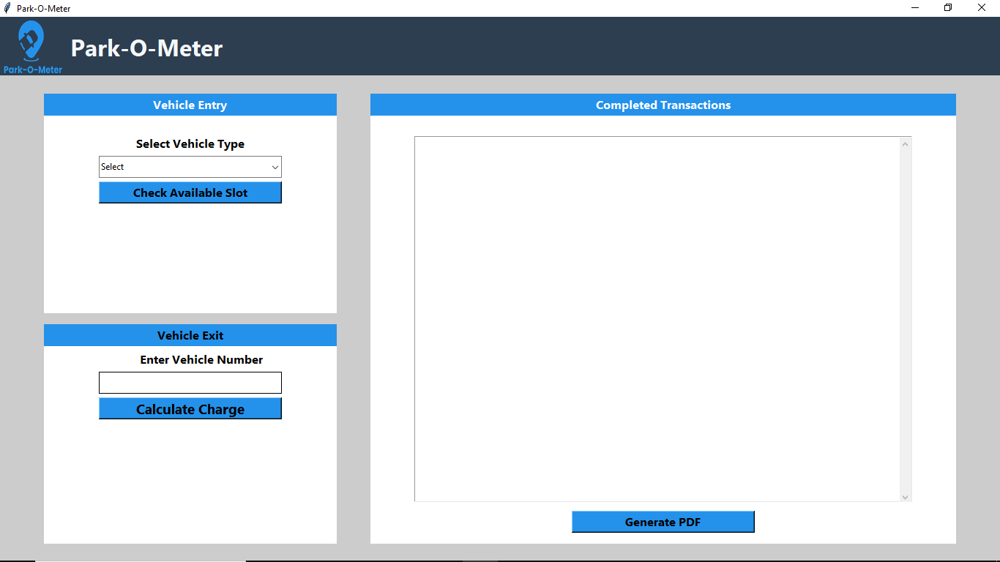
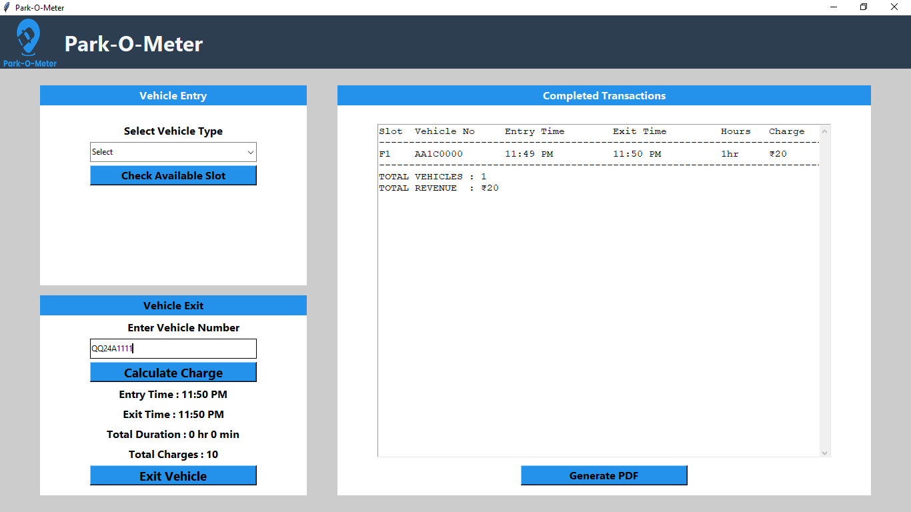
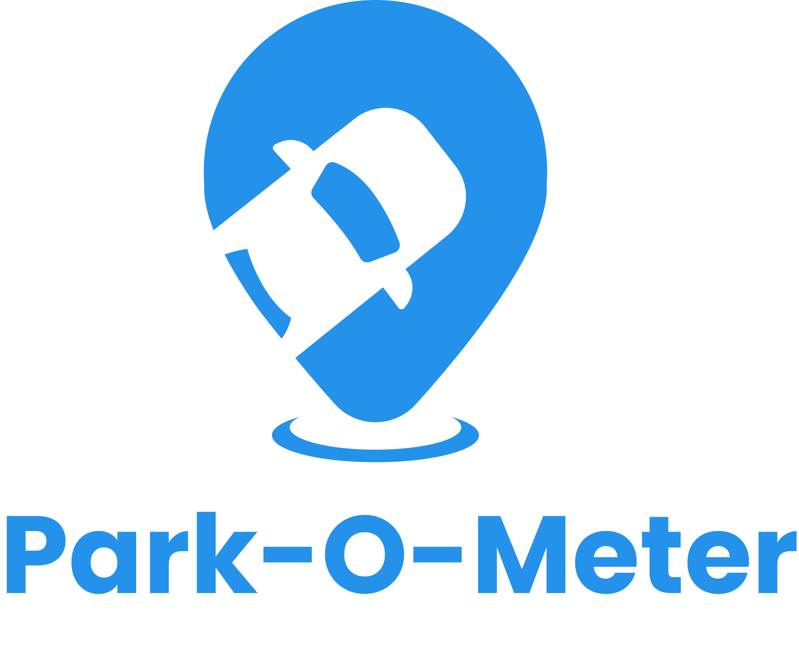

# Park-O-Meter – Smart Parking Lot Management System

## Introduction

Park-O-Meter is a Python-based GUI application that simulates a real-world parking lot system.  
The system handles vehicle entry and exit, parking slot allocation, time-based charge calculation, transaction tracking,
and revenue reporting through a single unified interface.

---

## Features

### Vehicle Entry
- Vehicle number input
- Vehicle type selection
- Automatic parking slot allocation
- Entry time recording

### Vehicle Exit
- Exit time calculation
- Parking charge calculation
- Slot release after exit
- Charge display before exit confirmation

### Supported Vehicle Types
- 2-Wheeler
- 4-Wheeler
- Electric Vehicle (EV)
- Heavy Vehicle

### Transaction Management
- Tracks complete entry-to-exit lifecycle
- Stores completed parking transactions in memory
- Displays parking details and charges

### Revenue Reporting
- Calculates total parking revenue
- Exports transaction reports as PDF

### User Interface
- Single-screen GUI layout
- Simple and user-friendly design
- Visual branding using logo
- All widgets use standard Tkinter (no CustomTkinter/CTK)
- Balanced spacing for frames, labels, buttons, and entry boxes

---

## Tech Stack
- Python 3
- Tkinter
- ReportLab
- Datetime
- Math
- PIL/Pillow (Python Imaging Library)

---

## Screenshots

## Logo

---

## System Architecture
- Parking Slot Manager
- Vehicle Entry Module
- Vehicle Exit Module
- Charge Calculator
- Transaction Tracker
- PDF Report Generator

---

## How To Run
- Clone the repository
- Ensure Python 3 is installed
- Install required libraries: `reportlab`, `pillow`
- Run `main.py`

---

## Notes
- This project does not use database persistence
- All data is stored in memory during runtime
- Data resets when the application is closed
- Focus is on real-time logic and GUI-based interaction
- Transaction table is non-editable to prevent accidental changes

---

## Future Enhancements
- Database integration
- Configurable parking rates
- Improved UI theming
- Session-based data storage
- Advanced reporting features

---

## Project Purpose

This project was developed as part of an internship to gain hands-on experience with:
- GUI development using Tkinter
- Real-time logic implementation
- Slot management systems
- Billing and transaction workflows

---

## Author
Adesh Prabhune
